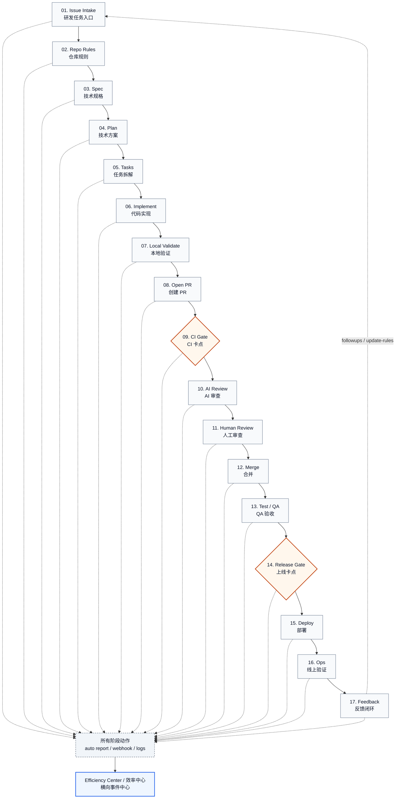

# AI-Friendly Dev-Test-Ops Workflow

本文档描述一套以 **Issue 为流程入口**、以 **Dev-Test-Ops 完整链路为骨架**、以 **AI Agent + 人工审核 + 自动化门禁** 为执行方式的研发工作流。主流程保留从需求进入、规格设计、实现验证、PR/CI/Review、QA、发布、部署、运维到反馈反哺的完整闭环；效率中心作为独立的横向事件中心，统一沉淀每个阶段的人、AI、工具和交付物状态。

## 流程总览

**Dev → PR → CI → Test → Release → Ops → Feedback**



所有阶段动作统一上报到独立的 **Efficiency Center / 效率中心**。效率中心不是主流程阶段，而是横向事件中心，单独成篇说明。

工具选型假设：

- **AI Agent**：当前假设使用 Codex；spec/plan/tasks/implement 优先走 GitHub Spec Kit 的社区命令。
- **Coding Agent**：当前假设使用 Codex，负责实现代码、补测试、跑验证、修 CI、整理 PR。
- **Agent SKILL**：优先使用 GitHub Spec Kit 生成的 agent skills / slash commands；本地动作再用 Codex SKILL 固化。
- **Automation Orchestrator**：当前假设使用 GitHub Actions 编排触发、校验、提交、PR、Review、部署门禁。

以上只是本文档的默认选型假设，不是强绑定；同类能力可以替换为其他 Agent、CI/CD 或研发平台实现。

GitHub Spec Kit 已内置 `/speckit.constitution`、`/speckit.specify`、`/speckit.clarify`、`/speckit.plan`、`/speckit.tasks`、`/speckit.implement`、`/speckit.analyze`、`/speckit.checklist` 等命令，本文档优先复用这些社区已有命令，只有 Spec Kit 不覆盖的工程动作再进入自定义 Gate / workflow。([GitHub Spec Kit][1])

AI 工作流工具边界：

| 类型 | 是否算 AI 工作流工具 | 在本文档里的定位 |
|---|---|---|
| GitHub Spec Kit | 是 | Dev 阶段的规格驱动 AI 工作流 |
| Codex / Codex Action / Codex SKILL | 是 | 代码执行、AI Review、本地动作固化 |
| Dify / n8n / LangGraph | 是 | QA、Release、Ops、Feedback 等跨系统 AI workflow 编排 |
| Robusta | 是 | Ops 告警分析、Grafana alert AI investigation |
| GitHub / CI / Grafana / Sentry / OTel / QA 平台 | 否 | AI workflow 的触发源、上下文、工具调用对象或执行结果来源 |

因此，本文档里的 **AI 工作流工具** 优先指能做 AI 推理、编排、审查、诊断或生成动作的工具；非 AI 工具只作为 AI workflow 连接和调用的对象。

---

## 01. Issue Intake / 研发任务入口

| 干什么 | 谁 | 建议命令 | AI 工作流工具 | 依赖工具 | 说明和例子 |
|---|---|---|---|---|---|
| 创建研发 Issue | 产品经理 / 技术负责人 / 开发 | create issue | 可选：n8n / Dify intake workflow | GitHub Issues / Jira / Meegle | Feature / Bug / Refactor / TechDebt |
| 补充上下文 | 开发 + AI Agent | /clarify | Codex / Dify | GitHub Actions / Issue comment | AI 补边界、复现步骤、验收条件 |
| 任务分流 | 技术负责人 / 自动化 | /triage | n8n / Dify | Projects / Labels / Actions | 设置负责人、优先级、里程碑 |
| 上报效率中心 | 自动化 | auto report | n8n / Dify | Webhook / Actions | 记录 Issue 创建和分流动作 |

<div align="center">
<div style="display: inline-block; text-align: left;">
｜<br>
｜阶段产物：<br>
｜issue.md / issue_context.json / 负责人 / 优先级 / labels<br>
｜<br>
↓ 02. Repo Rules / 仓库规则
</div>
</div>

---

## 02. Repo Rules / 仓库规则

| 干什么 | 谁 | 建议命令 | AI 工作流工具 | 依赖工具 | 说明和例子 |
|---|---|---|---|---|---|
| 定义 Agent 规则 | 技术负责人 / 架构师 | specify init | GitHub Spec Kit / Codex SKILL | AGENTS.md | 安装、测试、禁止事项 |
| 定义项目原则 | 技术负责人 / 架构师 | /speckit.constitution | GitHub Spec Kit | constitution.md | 技术原则、质量底线、约束 |
| 定义合并门禁 | 技术负责人 / 运维 | /init-gates | 可选：n8n / Dify gate setup workflow | Branch protection | CI green + required review |
| 上报效率中心 | 自动化 | auto report | n8n / Dify | Webhook / Actions | 记录规则初始化和变更 |

<div align="center">
<div style="display: inline-block; text-align: left;">
｜<br>
｜阶段产物：<br>
｜AGENTS.md / constitution.md / PR template / CODEOWNERS / branch protection<br>
｜<br>
↓ 03. Spec / 技术规格
</div>
</div>

---

## 03. Spec / 技术规格

| 干什么 | 谁 | 建议命令 | AI 工作流工具 | 依赖工具 | 说明和例子 |
|---|---|---|---|---|---|
| 生成技术规格 | AI Agent 起草，技术负责人审核 | /speckit.specify | GitHub Spec Kit | Issue context / repo docs | 输出 spec.md |
| 明确非目标 | AI Agent 起草，技术负责人审核 | /speckit.clarify | GitHub Spec Kit | spec.md / Issue comment | 明确不做什么 |
| 校验规格覆盖 Issue | 自动化 + 技术负责人 | /speckit.checklist | GitHub Spec Kit | issue_context.json / spec.md | 检查是否覆盖验收标准 |
| 上报效率中心 | 自动化 | auto report | n8n / Dify | Webhook / Actions | 记录 spec 生成和审核结果 |

<div align="center">
<div style="display: inline-block; text-align: left;">
｜<br>
｜阶段产物：<br>
｜spec.md / clarified scope / open questions / spec approval<br>
｜<br>
↓ 04. Plan / 技术方案
</div>
</div>

---

## 04. Plan / 技术方案

| 干什么 | 谁 | 建议命令 | AI 工作流工具 | 依赖工具 | 说明和例子 |
|---|---|---|---|---|---|
| 生成实现计划 | AI Agent 起草，技术负责人审核 | /speckit.plan | GitHub Spec Kit | spec.md / repo context | 输出 plan.md |
| 设计架构变更 | AI Agent 起草，架构师审核 | /speckit.plan | GitHub Spec Kit | ADR / C4 模板 | 输出 arch.md / ADR.md |
| 定义接口/契约 | AI Agent 起草，开发审核 | /contract | Codex / Dify | OpenAPI / AsyncAPI / Pact | openapi.yaml / event schema |
| 风险评估 | AI Agent 起草，人确认 | /speckit.plan | GitHub Spec Kit | 风险模板 / repo context | 数据迁移、兼容性、性能、安全 |
| 上报效率中心 | 自动化 | auto report | n8n / Dify | Webhook / Actions | 记录方案生成和风险结果 |

<div align="center">
<div style="display: inline-block; text-align: left;">
｜<br>
｜阶段产物：<br>
｜plan.md / arch.md / ADR.md / openapi.yaml / risk.md<br>
｜<br>
↓ 05. Tasks / 任务拆解
</div>
</div>

---

## 05. Tasks / 任务拆解

| 干什么 | 谁 | 建议命令 | AI 工作流工具 | 依赖工具 | 说明和例子 |
|---|---|---|---|---|---|
| 拆任务清单 | AI Agent 起草，开发确认 | /speckit.tasks | GitHub Spec Kit | plan.md / spec.md | 输出 tasks.md |
| 标记依赖关系 | AI Agent + 开发 | /speckit.tasks | GitHub Spec Kit | tasks.md | 标记串行 / 并行任务 |
| 标记测试任务 | AI Agent + 测试 / 开发 | /speckit.tasks | GitHub Spec Kit | tasks.md / test policy | 每个功能任务对应测试任务 |
| 上报效率中心 | 自动化 | auto report | n8n / Dify | Webhook / Actions | 记录任务拆解结果 |

<div align="center">
<div style="display: inline-block; text-align: left;">
｜<br>
｜阶段产物：<br>
｜tasks.md / task dependencies / test tasks / implementation-ready<br>
｜<br>
↓ 06. Implement / 代码实现
</div>
</div>

---

## 06. Implement / 代码实现

| 干什么 | 谁 | 建议命令 | AI 工作流工具 | 依赖工具 | 说明和例子 |
|---|---|---|---|---|---|
| 分配给 Coding Agent | 技术负责人 / 开发 | assign to agent | Codex | GitHub assignment | Issue 分配给 Codex |
| 创建分支 | 自动化 / AI Agent | /start-dev | Codex SKILL | Git worktree | branch: issue-123-xxx |
| 实现代码 | AI Agent 主写，开发兜底 | /speckit.implement | GitHub Spec Kit + Codex | repo / tasks.md | 按 tasks.md 改代码 |
| 补测试 | AI Agent 起草，开发确认 | /add-tests | Codex | test runner | unit / integration tests |
| 上报效率中心 | 自动化 | auto report | n8n / Dify | Agent logs / Webhook | 记录 Agent 操作、耗时、失败次数 |

<div align="center">
<div style="display: inline-block; text-align: left;">
｜<br>
｜阶段产物：<br>
｜code changes / tests / commits / implementation_summary.md / draft branch<br>
｜<br>
↓ 07. Local Validate / 本地验证
</div>
</div>

---

## 07. Local Validate / 本地验证

| 干什么 | 谁 | 建议命令 | AI 工作流工具 | 依赖工具 | 说明和例子 |
|---|---|---|---|---|---|
| 跑 lint/typecheck | 自动化 / AI Agent | /validate | Codex | npm scripts | pnpm lint && pnpm typecheck |
| 跑单元测试 | 自动化 / AI Agent | /unit-test | Codex | test runner | pnpm test |
| 跑集成/契约测试 | 自动化 | /integration-test | 可选：Codex 分析失败 | Testcontainers / Pact | DB / Redis / API contract |
| 解释失败 | AI Agent | /explain-failure | Codex | logs / test report | 根据报错继续修 |
| 上报效率中心 | 自动化 | auto report | n8n / Dify | Test report collector | 记录测试耗时、失败类型、修复次数 |

<div align="center">
<div style="display: inline-block; text-align: left;">
｜<br>
｜阶段产物：<br>
｜validation.md / local test report / fixed failures<br>
｜<br>
↓ 08. Open PR / 创建 PR
</div>
</div>

---

## 08. Open PR / 创建 PR

| 干什么 | 谁 | 建议命令 | AI 工作流工具 | 依赖工具 | 说明和例子 |
|---|---|---|---|---|---|
| 创建 PR | AI Agent / 自动化 | /open-pr | Codex SKILL | GitHub CLI | PR 关联 Issue 和 spec |
| 生成 PR 描述 | AI Agent | /summarize-pr | Codex | PR template / git diff | Summary / tests / risk |
| 请求 Review | 自动化 | request review | 可选：n8n / Dify routing workflow | CODEOWNERS / GitHub reviewers | 自动找代码审查人 |
| 上报效率中心 | 自动化 | auto report | n8n / Dify | GitHub Webhook | 记录 PR 创建、Review 分配 |

<div align="center">
<div style="display: inline-block; text-align: left;">
｜<br>
｜阶段产物：<br>
｜Pull Request / PR description / linked issue / linked spec<br>
｜<br>
↓ 09. CI Gate / CI 卡点
</div>
</div>

---

## 09. CI Gate / CI 卡点

| 干什么 | 谁 | 建议命令 | AI 工作流工具 | 依赖工具 | 说明和例子 |
|---|---|---|---|---|---|
| 检查前置交付物 | 自动化 | /speckit.analyze + CI gate | GitHub Spec Kit | GitHub Actions | spec、plan、tasks、tests、PR 描述必须齐 |
| 自动跑 CI | 自动化 | auto on PR | 无，作为触发源 | GitHub Actions / GitLab CI | push / PR 自动触发 |
| 质量检查 | 自动化 | lint / test / build | 可选：Codex 分析失败 | CI pipeline | required checks |
| 安全扫描 | 自动化 | security scan | 可选：Codex 分析报告 | CodeQL / Trivy / Dependabot | 高危阻断 |
| 解释 CI 失败 | AI Agent | /explain-ci | Codex | CI logs | 给修复建议 |
| 上报效率中心 | 自动化 | auto report | n8n / Dify | CI Webhook / Workflow logs | 记录 CI 卡点、失败原因、耗时 |

**CI Gate 必须满足**：

- issue_context.json 存在
- spec.md 存在并 approved
- plan.md 存在
- tasks.md 存在
- implementation_summary.md 存在
- tests 已新增或说明无需新增
- PR description 完整
- lint / test / build / security 全部通过

<div align="center">
<div style="display: inline-block; text-align: left;">
｜<br>
｜阶段产物：<br>
｜ci-summary.json / coverage report / security report / build artifact / ci-gate-result.json<br>
｜<br>
↓ 10. AI Review / AI 审查
</div>
</div>

---

## 10. AI Review / AI 审查

| 干什么 | 谁 | 建议命令 | AI 工作流工具 | 依赖工具 | 说明和例子 |
|---|---|---|---|---|---|
| 规则化 AI Review | AI Agent | /ai-review | Codex Action / review SKILL | PR diff / review rules | 输出 review.json 并发布 PR review |
| 检查测试缺口 | AI Agent | /check-tests | Codex review SKILL | diff / test report | 改了逻辑但没测，标红 |
| 检查 Spec Drift | AI Agent | /check-spec-drift | Codex | spec_context.md / pr_diff.txt | 实现是否偏离 spec.md |
| 生成修复建议 | AI Agent | auto | Codex | PR diff | red check + suggested diff |
| 上报效率中心 | 自动化 | auto report | n8n / Dify | Review Webhook | 记录 AI review 命中问题和修复率 |

<div align="center">
<div style="display: inline-block; text-align: left;">
｜<br>
｜阶段产物：<br>
｜AI status checks / review.json / suggested diff / risk notes<br>
｜<br>
↓ 11. Human Review / 人工审查
</div>
</div>

---

## 11. Human Review / 人工审查

| 干什么 | 谁 | 建议命令 | AI 工作流工具 | 依赖工具 | 说明和例子 |
|---|---|---|---|---|---|
| 审代码正确性 | 代码审查人 / 技术负责人 | review | 可选：Codex review summary | GitHub PR Review | 看 diff、架构、边界、异常处理 |
| 审风险和回滚 | 代码审查人 / 技术负责人 | review risk | Codex / Dify | PR checklist | 兼容性、数据、安全、回滚 |
| 要求修改 | 代码审查人 | request changes | Codex 接收修改任务 | GitHub Review | AI Agent 或开发继续修 |
| 批准合并 | 代码审查人 / 技术负责人 | approve | 无，人工决策 | Branch protection | 人最终负责 |
| 上报效率中心 | 自动化 | auto report | n8n / Dify | GitHub Review Webhook | 记录 Review 耗时、返工次数 |

<div align="center">
<div style="display: inline-block; text-align: left;">
｜<br>
｜阶段产物：<br>
｜review comments / approval / requested changes / merge decision<br>
｜<br>
↓ 12. Merge / 合并
</div>
</div>

---

## 12. Merge / 合并

| 干什么 | 谁 | 建议命令 | AI 工作流工具 | 依赖工具 | 说明和例子 |
|---|---|---|---|---|---|
| 检查合并条件 | 自动化 | merge gate | 可选：n8n / Dify gate workflow | Branch protection / Merge queue | CI + AI checks + human approval |
| 合并 PR | 人 / 自动化 | merge | 无，平台执行 | GitHub merge / auto-merge | squash / merge queue |
| 关闭研发 Issue | 自动化 | auto close | 可选：n8n | GitHub linked issue | Closes #123 |
| 生成研发总结 | AI Agent | /summary | Codex | merged PR / issue context | final-summary.md |
| 上报效率中心 | 自动化 | auto report | n8n / Dify | GitHub Webhook | 记录合并、关闭、总结 |

<div align="center">
<div style="display: inline-block; text-align: left;">
｜<br>
｜阶段产物：<br>
｜merged PR / closed dev issue / final-summary.md / follow-up issues<br>
｜<br>
↓ 13. Test / QA 验收
</div>
</div>

---

## 13. Test / QA 验收

| 干什么 | 谁 | 建议命令 | AI 工作流工具 | 依赖工具 | 说明和例子 |
|---|---|---|---|---|---|
| 生成测试计划 | AI Agent 起草，测试审核 | /test-plan | Dify / n8n / Codex | Test template / spec.md | test-plan.md |
| 生成测试用例 | AI Agent 起草，测试补充 | /test-cases | Dify / n8n / Codex | TestRail / Zephyr / Xray / 自建 | 覆盖 AC、边界、回归场景 |
| 执行测试 | 测试 + 自动化 | /run-qa | n8n / LangGraph | Playwright / Cypress / Test platform | 自动化 + 手工探索测试 |
| 验收通过/打回 | 测试 / 产品经理 | /qa-pass /qa-fail | Dify / n8n | QA board / Bug tracker | 失败创建 bug issue |
| 上报效率中心 | 自动化 | auto report | n8n / Dify | QA Webhook / Test report | 记录用例数、失败数、缺陷分布 |

<div align="center">
<div style="display: inline-block; text-align: left;">
｜<br>
｜阶段产物：<br>
｜test-plan.md / test-cases.md / regression-scope.md / qa-report.md / bug issues / qa-signoff<br>
｜<br>
↓ 14. Release Gate / 上线卡点
</div>
</div>

---

## 14. Release Gate / 上线卡点

| 干什么 | 谁 | 建议命令 | AI 工作流工具 | 依赖工具 | 说明和例子 |
|---|---|---|---|---|---|
| 检查所有前置完成 | 自动化 | /release-gate | Dify / n8n / LangGraph | GitHub Environments / Gate script | 前面所有交付物必须完成 |
| 生成发布计划 | AI Agent 起草，运维/技术负责人审核 | /release-plan | Dify / Codex | Release template | release.md |
| 生成回滚计划 | AI Agent 起草，运维审核 | /rollback-plan | Dify / Codex | Runbook / CD history | rollback.md |
| 发布审批 | 技术负责人 / 运维 / 产品经理 | approve release | 无，人工决策 | GitHub Environment reviewers | 人批准后才能部署生产 |
| 上报效率中心 | 自动化 | auto report | n8n / Dify | Deployment Webhook | 记录上线卡点、审批、阻断原因 |

**Release Gate 必须满足**：

- dev issue closed
- PR merged
- CI Gate passed
- AI Review passed
- Human Review approved
- QA passed
- release.md 存在
- rollback.md 存在
- observability checklist 完成
- owner approval 完成

<div align="center">
<div style="display: inline-block; text-align: left;">
｜<br>
｜阶段产物：<br>
｜release-gate-result.json / release.md / rollback.md / approval record<br>
｜<br>
↓ 15. Deploy / 部署
</div>
</div>

---

## 15. Deploy / 部署

| 干什么 | 谁 | 建议命令 | AI 工作流工具 | 依赖工具 | 说明和例子 |
|---|---|---|---|---|---|
| 部署 Staging | 自动化 | /deploy-staging | n8n / LangGraph | GitHub Actions / Argo CD | staging smoke |
| 部署 Production | 人批准，自动化执行 | /deploy-prod | n8n / LangGraph | CD / Environments / Feature flag | 灰度发布 |
| 记录部署结果 | 自动化 | auto | n8n / Dify | CD report | deploy-report.json |
| 上报效率中心 | 自动化 | auto report | n8n / Dify | CD Webhook / Deploy logs | 记录部署耗时、版本、环境、结果 |

<div align="center">
<div style="display: inline-block; text-align: left;">
｜<br>
｜阶段产物：<br>
｜deploy-report.json / deployed version / rollout status<br>
｜<br>
↓ 16. Ops / 线上验证
</div>
</div>

---

## 16. Ops / 线上验证

| 干什么 | 谁 | 建议命令 | AI 工作流工具 | 依赖工具 | 说明和例子 |
|---|---|---|---|---|---|
| 检查核心指标 | 自动化 + SRE | /verify-prod | Robusta / Dify / n8n | Grafana / Datadog / Sentry | error rate / latency / traffic |
| 异常诊断 | AI Agent | /diagnose | Robusta / Dify / LangGraph | Logs / Traces / Metrics | 关联 recent release |
| 回滚/事故处理 | SRE / 运维 / 技术负责人 | /rollback /incident | Dify / n8n / LangGraph | Rollback pipeline / PagerDuty | 人判断，自动化执行 |
| 更新 Runbook | AI Agent 起草，SRE 审核 | /update-runbook | Codex / Dify | ops/runbooks | 固化处理流程 |
| 上报效率中心 | 自动化 | auto report | n8n / Dify | Observability Webhook | 记录线上指标、告警、回滚、事故 |

<div align="center">
<div style="display: inline-block; text-align: left;">
｜<br>
｜阶段产物：<br>
｜ops-report.md / metrics-check.md / diagnosis.md / incident.md / rollback-report.md / runbook update<br>
｜<br>
↓ 17. Feedback / 反馈闭环
</div>
</div>

---

## 17. Feedback / 反馈闭环

| 干什么 | 谁 | 建议命令 | AI 工作流工具 | 依赖工具 | 说明和例子 |
|---|---|---|---|---|---|
| 生成最终总结 | AI Agent | /final-summary | Dify / Codex / LangGraph | Issue / PR / QA / Ops reports | final-summary.md |
| 创建后续任务 | AI Agent 起草，人确认 | /followups | Dify / n8n / Codex | GitHub Issues / Jira | 技术债、测试补强、监控补强 |
| 反哺规则 | AI Agent 建议，人审核 | /update-rules | Codex / Dify | AGENTS.md / checks / runbook | 重复问题写进规则 |
| 上报效率中心 | 自动化 | auto report | n8n / Dify | Efficiency Center | 汇总完整交付链路指标 |

<div align="center">
<div style="display: inline-block; text-align: left;">
｜<br>
｜阶段产物：<br>
｜final-summary.md / follow-up issues / updated AGENTS.md / updated checks / updated runbook / efficiency report<br>
｜<br>
↓ 反哺：01. Issue Intake / 研发任务入口
</div>
</div>

## Efficiency Center / 效率中心

效率中心不放在主流程里。它是主流程之外的横向事件中心，接收 Issue、PR、CI、Review、QA、Deploy、Ops、Feedback 等所有工具动作上报。

| 干什么 | 谁 | 建议命令 | AI 工作流工具 | 依赖工具 | 说明和例子 |
|---|---|---|---|---|---|
| 收集所有工具动作 | 自动化 | auto report | n8n / Dify | GitHub Webhook / Actions | issue、PR、CI、Review、Deploy 都上报 |
| 记录人和 AI 的操作 | 自动化 | auto audit | n8n / Dify | GitHub API / Agent logs | 谁触发、何时触发、结果如何 |
| 汇总阶段交付物 | 自动化 + AI | /sync-status | Dify / LangGraph | 效率中心 / 数据库 / Dashboard | 每个 Issue 的进度、产物、卡点 |
| 生成效率指标 | AI + 自动化 | /metrics | Dify / LangGraph | OTel / BI / Dashboard | Lead time、返工次数、CI失败率、Review耗时 |

上报事件格式：

```json
{
  "issue_id": "",
  "stage": "",
  "command": "",
  "actor_type": "",
  "actor": "",
  "tool": "",
  "status": "",
  "artifacts": [],
  "started_at": "",
  "finished_at": "",
  "error": ""
}
```

“效率中心”最好不要只是日志库，而是一个**研发过程事件中心**：所有工具动作都用统一事件格式上报，再做 Issue 维度、阶段维度、角色维度、Agent 维度的统计。OpenTelemetry 的思路可以借用，因为它本身就是把 logs、metrics、traces 作为可关联的信号来采集和分析。([opentelemetry.io][2])

[1]: https://github.github.com/spec-kit/index.html "GitHub Spec Kit"
[2]: https://opentelemetry.io/docs/specs/otel/logs/?utm_source=chatgpt.com "OpenTelemetry Logging"
